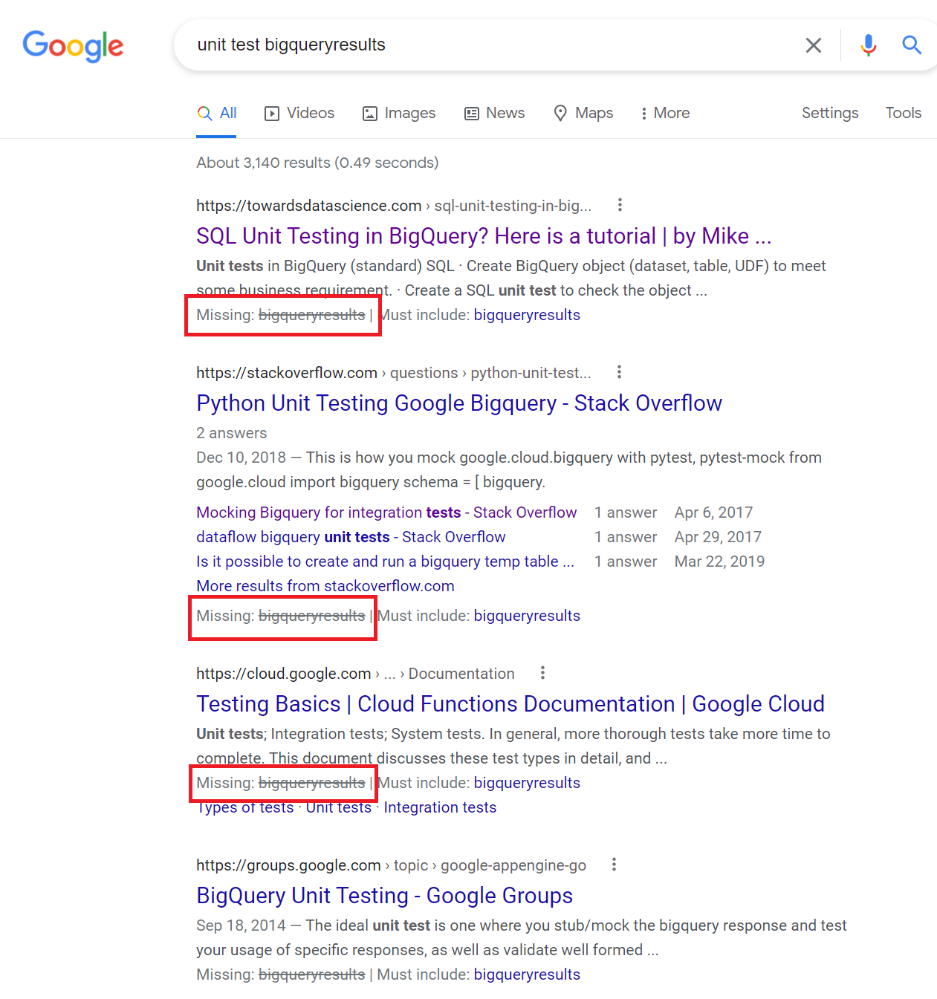

# Overview
Included here is an example test setup of the `BigQueryResults` object, used to test any dependencies on `BigQueryResults` in code.

# Background
Issuing a query to Google Cloud's BigQuery service via `Google.Cloud.BigQuery.V2.BigQueryClient` returns a `BigQueryResults` in response. Unit testing code depending on the results is not a straight-forward matter, and surprisingly, there's little (or no) Google Cloud documentation nor web guides that provide assistance.

___Here's a set of Google search results:___

